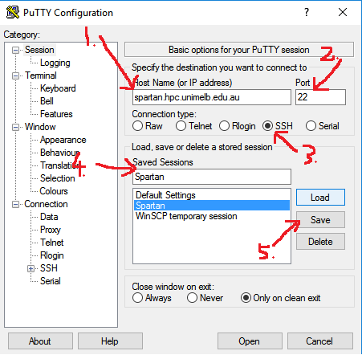
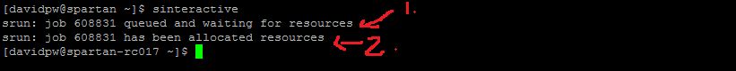

# What is Spartan?

The University of Melbourne's general purpose hybrid traditional high performance computing system (HPC) with cloud instances from the NeCTAR Research Cloud and attached Research Data Storage Services (RDSS).

It is designed to suit the needs of researchers whose desktop/laptop is not up to the particular task. Models running slow, datasets are too big, not enough cores, application licensing issues, etc.

Spartan consists of:

*  a management node for system administrators,
*  a login node for users to connect to the system and submit jobs,
*  a small number of 'bare metal' compute nodes for multinode tasks,
*  any 'bare metal' user-procured hardware (e.g., departmental nodes),
*  vHPC cloud compute nodes for overflow and GPGPU tasks, and
*  general cloud compute nodes.

# Accessing Spartan

## Getting an Account

To gain access to Spartan you need to create an account.

*  Via Karaage at [link](https://dashboard.hpc.unimelb.edu.au/karaage)
*  Need to create a project
+  Needs a project leader (you), and you can invite collaborators for joint projects
+  Needs a project title/description to demonstrate research goals and/or research support 
*  Takes ~2 days for approval

***


***

## Required Programs

To connnect to Spartan you will need a Secure Shell (SSH) and a Secure File Transfer Protocol (SFTP) client. The SSH client is your interface with Spartan while the SFTP client is used to transfer files from your local computer to your Spartan home directory.

### Windows Users

Use PuTTY as your SSH client. This is an easy set-up with the following five steps:

1.  Set your host name: spartan.hpc.unimelb.edu.au
2.  Set your port number: leave as default (whereas Boab users need a defined port)
3.  Set your connection type: SSH
4.  Name your session to make it easy for future log-ins: Whatever you like i.e. Spartan
5.  Save your session details

***


***

Your first log-in to Spartan via the SSH client creates your home directory on Spartan so it is important to do that before setting up your SFTP client.

Use WinSCP as your SFTP client. This is an easy process with the following six steps:

1.  Set your file protocol: SFTP
2.  Set your hhost name: spartan.hpc.unimelb.edu.au
3.  Set your port number:leave as default (whereas Boab users need a defined port)
4.  Enter your username
5.  Enter your password (note, this will show more characters than you entered when saved)
6.  Login

***


***
Inside a WinSCP session you will have dual file explorer windows: your local machine (left) and your Spartan home directory). If you have not made your initial log-in to Spartan via your SSH client you will have a blank white screen in the right-hand window. Transferring files between the two directories is with a simple drag-and-drop interface.

***


***

Your two clients are now set up and everything is ready to access Spartan. After set-up you don't need to directly deal with PuTTy anymore as there is a button in the WinSCP toolbar to open a session.

***


***

### Mac/Linux Users

See Nick

## Log in to Spartan

Now that you have everything in place to access Spartan, open a session and you will be prompted to log in. Note: This wont display characters as you type your password.

***


***

The text that loads at the beginning gives you the usual university IT policy spiel, a couple of getting started prompts, a warning about the log-in node, and the obligatory 300 reference.

***


***

## Help

Typing `man Spartan` loads the university's Spartan FAQ. Rather than loading the entire document it loads it a screen at a time and you have to navigate by keyboard commands. For now, you will only need these:

*  `h`: help, shows you the keyboard shortcuts
*  `q`: quit the document and go back to the Spartan interface
*  `^` is used in place of the control/command button, so `^V` is Ctrl+V
*  `Enter/Return` will let you advance by one line
*  `^Y` will let you go back by one line
*  `^V` will let you advance by one window
*  `^B` will let you go back by one window

***


***

If you want help with a particular function in Spartan you can type `man <function name>` (without < >). This works like `?` in R.

# Using Spartan

The log-in node on Spartan is a shared resource between all users and is only allocated the memory to handle log-ins and job submission. Do not run jobs in the log-in node or the admins will get upset and kill the job. There are two ways to get out of the log-in node and into proper compute nodes: `sinteractive` and `sbatch`.

## sinteractive

The `sinteractive` command will give you access to a compute node (as soon as available) where you can work interactively with your job. While you can build an entire job in this method, that is better saved for `sbatch` and `sinteractive` used for testing/debugging. There are default settings for `sinteractive` which should be enough for most uses, but they can be modified if needed like so:

```{r eval=FALSE}
sinteractive --time=00:10:00 --nodes=1 --ntasks=2
```

This will give you access to one node with two processors for ten minutes (default values I think). Lets open a default node and explore some basic commands. Type `sinteractive`. This makes a request for a default compute node (1), and you have to wait for the resource to become available (2) before you can continue.

***


***

The `ls` command will show you everything in your current directory. Folders show up in blue.

***


***

The `cd` command will let you change your current directory. As Spartan is linux based it uses / not \ for directories (unlike Windows). The \ character is used to say that the preceeding term is a special character. Lets change into a subfolder and see what is inside. Spartan lets you pre-fill file paths/names using the tab key like R, but it will pre-fill everything until a choice needs to be made, and won't provide options at that stage, but will complete everything once no more divergences exist.

***


***

The programs available on Spartan as referred to as modules, and you can see a complete list using `module avail`.

***


***

Loading a particular module requires two commands: `module load <module name>` (to load the module on the node) and `<module name>` (to start the program). To load R for example:

***


***

## sbatch

The `sbatch` command is used for direct job submission to Spartan using the batch system called SLURM (Simple Linux Utility for Resource Management). 

***


***

This system tracks resources throughout the cluster and builds a queue of jobs to run, and when resources are available the job scheduler will direct your job to a compute nod to run.

***


***

To submit a job using the `sbatch` command you need to write a slurm file that sets up your instance (amount of memory, number of processors, etc) and runs your model.

***


***


•	Creating your SLURM file:
o	Simple Linux Utility for Resource Management
o	This is where you set the resource parameters for the model run
o	Best to do so in Notepad++ (for Windows users only?) due to difference in end of line notation between Oss.
o	Series of #SBATCH commands
o	List common examples
•	Modifying your code files:
o	As Spartan runs on linux you may need to de-Windows-ify the code
o	/ or \ in file paths is OS dependant
o	Line end notation
•	Now that you have all of the pieces, putting it together and submitting to Spartan
o	Open SSH client
o	Log-in
o	Either sbatch or sinteractive gets you out of Log-in node and into a compute node
	Don’t run models in log-in node or admins will get upset and kill your job
o	Sbatch is a direct command (i.e. queue this model)
	Sbatch filename.slurm
o	Sinteractive lets you do things step by step
	Sinteractive
	Module load R
	R
	Filename
	Lets you test that things work as intended on Spartan before submitting a job to queue
o	Useful commands:
	Squeue -u <username>
•	Lets you see the status of all of your jobs
	Squeue -u <username> -t RUNNING (or PENDING
	Scancel <jobid>
•	Cancel particular job
	Scancel -u <username>
•	Cancel all of your jobs
	Scancel -t PENDING -u <username>
•	Cancel all pending jobs
	Man <function name>
•	Look at manual for function. Like ?in R
•	Man spartan
	scontrol show jobid -d <jobid>
•	detailed information on jobs
	sstat --format=AveCPU,AvePages,AveRSS,AveVMSize,JobID -j <jobid> --allsteps
•	information on currently running jobs
	sacct -j <jobid> --format=JobID,JobName,MaxRSS,Elapsed
	sacct -u <username> --format=JobID,JobName,MaxRSS,Elapsed
•	these two provide additional information on completed jobs i.e. runtime, memory used, etc
•	Other commands that I need to explore further:
o	Salloc and srun for parallelisation
